# 🎯 ALUR SISTEM KASIR - MERMAID FLOWCHART CODE
## Copy-Paste ke Mermaid AI untuk render

```mermaid
graph TD
    START["🚀 START - APLIKASI KASIR PINJAMAN ALAT"]
    
    START --> LANDING["🏠 LANDING PAGE"]
    LANDING --> LP1["Homepage / Index Publik"]
    LP1 --> LP1A["Hero Section:"]
    LP1A --> LP1A1["Logo Aplikasi"]
    LP1A --> LP1A2["Tagline: 'Sewa Alat Mudah, Terpercaya, Cepat'"]
    LP1A --> LP1A3["Background: Banner Alat Sewa"]
    
    LP1 --> LP2["📋 INFORMASI SISTEM"]
    LP2 --> LP2A["Keunggulan Sistem:"]
    LP2A --> LP2A1["✅ Proses Sewa Cepat"]
    LP2A --> LP2A2["✅ Harga Kompetitif"]
    LP2A --> LP2A3["✅ Alat Berkualitas"]
    LP2A --> LP2A4["✅ Return Mudah"]
    LP2A --> LP2A5["✅ Rating & Review Transparan"]
    
    LP1 --> LP3["🛒 PREVIEW ALAT (Tanpa Login)"]
    LP3 --> LP3A["Tampil 6-8 Alat Terbaru"]
    LP3A --> LP3B["Card Alat: Gambar, Nama, Kategori, Harga"]
    LP3B --> LP3C["Rating Preview (Bintang)"]
    LP3C --> LP3D["Tombol: [Lihat Detail] [Sewa Sekarang]"]
    LP3D --> LP3D1["❌ Blocked tanpa login"]
    LP3D1 --> LP3D2["Redirect ke Login"]
    
    LP1 --> LP4["📊 STATISTICS (Public View)"]
    LP4 --> LP4A["Total Alat: 150+"]
    LP4 --> LP4B["Total User: 5000+"]
    LP4 --> LP4C["Total Transaksi Sukses: 10000+"]
    LP4 --> LP4D["Rating Rata-rata: 4.8/5"]
    
    LP1 --> LP5["👥 TESTIMONI"]
    LP5 --> LP5A["Slider Testimoni Pelanggan"]
    LP5A --> LP5B["Nama, Rating, Komentar"]
    LP5B --> LP5C["Alat yang Disewa"]
    
    LP1 --> LP6["❓ FAQ"]
    LP6 --> LP6A["Pertanyaan Umum:"]
    LP6A --> LP6A1["Bagaimana cara menyewa?"]
    LP6A --> LP6A2["Berapa lama durasi minimal?"]
    LP6A --> LP6A3["Biaya apa saja yang perlu dibayar?"]
    LP6A --> LP6A4["Bagaimana jika alat rusak?"]
    LP6A --> LP6A5["Apa ada garansi?"]
    
    LP1 --> LP7["📞 KONTAK & FOOTER"]
    LP7 --> LP7A["Alamat, No Telepon, Email"]
    LP7 --> LP7B["Social Media Links"]
    LP7 --> LP7C["Copyright & Terms"]
    
    LP7 --> LP8{CTA - NEXT STEP?}
    LP8 -->|Baru Pertama Kali| REG["📝 HALAMAN REGISTER"]
    LP8 -->|Sudah Punya Akun| LOGIN["🔐 HALAMAN LOGIN"]
    LP8 -->|Lihat Alat Lebih| LP3
    
    REG --> R1["GET /register"]
    R1 --> R1A["📝 FORM REGISTER"]
    R1A --> R1A1["Input: Nama Lengkap"]
    R1A --> R1A2["Input: Email"]
    R1A --> R1A3["Input: Password"]
    R1A --> R1A4["Input: No Telepon"]
    R1A --> R1A5["Input: Alamat"]
    R1A --> R1A6["Role: Pilih Pelanggan"]
    R1A --> R1A7["Tombol: [Daftar] [Sudah Punya Akun?]"]
    R1A7 --> R1B["POST /register"]
    R1B --> R1C["✅ Email Verification"]
    R1C --> R1D["Email Konfirmasi Dikirim"]
    R1D --> R1E["Klik Link → Verifikasi Email"]
    R1E --> R1F["✅ Akun Terdaftar"]
    R1F --> LOGIN
    
    LOGIN --> LOG1["🔐 PILIH ROLE/TIPE USER"]
    LOG1 --> LOG1A["👤 Pelanggan"]
    LOG1 --> LOG1B["👨‍💼 Petugas"]
    LOG1C["🔑 Admin"]
    
    LOG1A --> LOG2A["📝 Form Login Pelanggan"]
    LOG2A --> LOG2A1["Input: Email + Password"]
    LOG2A --> LOG2A2["Checkbox: Remember Me"]
    LOG2A --> LOG2A3["Link: Lupa Password?"]
    LOG2A --> LOG2A4["Tombol: [Login] [Register]"]
    LOG2A4 --> LOG2A_SUBMIT["POST /login"]
    LOG2A_SUBMIT --> LOG2A_VALID["Validasi Kredensial"]
    LOG2A_VALID --> LOG2A_SUCCESS["✅ Login Berhasil"]
    LOG2A_SUCCESS --> CUST_DASH["📊 DASHBOARD PELANGGAN"]
    
    LOG1B --> LOG2B["📝 Form Login Petugas"]
    LOG2B --> LOG2B1["Input: Username + Password"]
    LOG2B --> LOG2B2["Tombol: [Login]"]
    LOG2B2 --> LOG2B_SUBMIT["POST /login-officer"]
    LOG2B_SUBMIT --> LOG2B_VALID["Validasi Kredensial Petugas"]
    LOG2B_VALID --> LOG2B_SUCCESS["✅ Login Berhasil"]
    LOG2B_SUCCESS --> PET_DASH["📊 DASHBOARD PETUGAS"]
    
    LOG1C --> LOG2C["📝 Form Login Admin"]
    LOG2C --> LOG2C1["Input: Email + Password"]
    LOG2C --> LOG2C2["Tombol: [Login]"]
    LOG2C2 --> LOG2C_SUBMIT["POST /login-admin"]
    LOG2C_SUBMIT --> LOG2C_VALID["Validasi Kredensial Admin"]
    LOG2C_VALID --> LOG2C_SUCCESS["✅ Login Berhasil"]
    LOG2C_SUCCESS --> ADM_DASH["📊 DASHBOARD ADMIN"]
    
    CUST_DASH --> C1["Menu Utama:"]
    C1 --> C1A["1. 🛒 Belanja Alat"]
    C1 --> C1B["2. 📋 Riwayat Transaksi"]
    C1 --> C1C["3. ⭐ Rating Saya"]
    C1 --> C1D["4. 👤 Edit Profil"]
    
    C1A --> C2["GET /customer/belanja"]
    C2 --> C2A["📂 LIST ALAT - Kategori & Filter"]
    C2A --> C2B["Filter: Kategori, Harga, Rating, Stok"]
    C2B --> C2C["Klik Alat → Buka Detail"]
    C2C --> C3["📍 HALAMAN DETAIL ALAT"]
    C3 --> C3A["Gambar Alat (Carousel)"]
    C3 --> C3B["Info: Nama, Kategori, Stok, Harga"]
    C3 --> C3C["⭐ Rating Summary: Bintang + Jumlah Review"]
    C3 --> C3D["👥 List Review dari Pelanggan Lain"]
    C3 --> C3E["📋 FORM PEMINJAMAN"]
    C3E --> C3E1["Durasi: 1 jam / 2 jam / 3+ jam"]
    C3E --> C3E2["Qty: +/- Buttons"]
    C3E1 --> C3F["💰 REAL-TIME PRICE CALCULATION"]
    C3E2 --> C3F
    C3F --> C3F1{Durasi?}
    C3F1 -->|1 jam| CALC1["Normal Price × Qty"]
    C3F1 -->|2 jam| CALC2["Normal Price × 1.2 × Qty"]
    C3F1 -->|3+ jam| CALC3["Normal Price × 0.9 × Qty"]
    CALC1 --> C3G{Aksi?}
    CALC2 --> C3G
    CALC3 --> C3G
    C3G -->|Add to Cart| CART["🛒 Tambah Keranjang"]
    C3G -->|Sewa Langsung| C4["➡️ KONFIRMASI"]
    CART --> SUCCESS1["✅ Item Added"]
    SUCCESS1 --> C2
    
    C4 --> C4A["GET /customer/belanja/konfirmasi-detail/{id}"]
    C4A --> C4B["📝 HALAMAN KONFIRMASI DETAIL"]
    C4B --> C4B1["Kiri 30%: Gambar + Info Alat"]
    C4B --> C4B2["Kanan 70%: Rincian Pembayaran"]
    C4B2 --> C4B2A["Durasi: X jam"]
    C4B2 --> C4B2B["Qty: X unit"]
    C4B2 --> C4B2C["Harga/Unit: Rp X"]
    C4B2 --> C4B2D["Multiplier: 1.0/1.2/0.9"]
    C4B2 --> C4B2E["Subtotal: Rp X"]
    C4B2 --> C4B2F["Diskon: Rp X (jika ada)"]
    C4B2 --> C4B2G["💰 TOTAL: Rp X"]
    C4B --> C4C["Info Penyewa:"]
    C4C --> C4C1["Nama, Email, No Telepon"]
    C4C --> C4C2["Alamat Pengambilan"]
    C4B --> C4D{Tombol?}
    C4D -->|✓ Konfirmasi| C5["POST /customer/belanja/proses-pinjaman/{id}"]
    C4D -->|← Kembali| C3
    
    C5 --> C5A["⚙️ PROSES BACKEND"]
    C5A --> C5A1["✅ Validasi: Durasi >= 0.5 jam"]
    C5A1 --> C5A2["✅ Validasi: Stok >= Qty"]
    C5A2 --> C5A3["✅ Hitung Progressive Pricing"]
    C5A3 --> C5A4["✅ CREATE Transaksi"]
    C5A4 --> C5A4A["user_id, total, status=SELESAI"]
    C5A4 --> C5A5["✅ CREATE TransaksiDetail"]
    C5A5 --> C5A5A["alat_id, qty, durasi, harga"]
    C5A5 --> C5A6["✅ Kurangi Stok Alat"]
    C5A6 --> SUCCESS2["✅ Transaksi Berhasil Dibuat"]
    
    SUCCESS2 --> C6["📄 DETAIL TRANSAKSI"]
    C6 --> C6A["GET /customer/riwayat/{id}"]
    C6A --> C6A1["No Transaksi, Tanggal, Status: SELESAI"]
    C6A --> C6A2["Tabel Detail: Alat, Durasi, Qty, Harga"]
    C6A --> C6A3["💰 TOTAL PEMBAYARAN"]
    C6A --> C6B["⭐ FORM RATING (Status = Selesai)"]
    
    C6B --> C7["⭐ FORM RATING & ULASAN"]
    C7 --> C7A["Untuk Setiap Alat di Transaksi"]
    C7A --> C7B["1️⃣ Pilih Bintang 1-5"]
    C7A --> C7C["2️⃣ Input Komentar (Maks 1000)"]
    C7B --> C7D{Rating Ada?}
    C7C --> C7D
    C7D -->|Belum Ada| C7D1["POST /customer/rating/store"]
    C7D -->|Ada| C7D2["PUT /customer/rating/update/{id}"]
    C7D1 --> C7E["✅ Rating Tersimpan"]
    C7D2 --> C7E
    C7E --> C7F["Badge Hijau ✓ Muncul"]
    
    C1B --> C8["📋 RIWAYAT TRANSAKSI"]
    C7F --> C8
    C8 --> C8A["GET /customer/riwayat"]
    C8A --> C8B["List Semua Transaksi"]
    C8B --> C8C["Filter: Status (Selesai/Pending)"]
    C8C --> C8D["Setiap Item: No, Tanggal, Harga, Badge Rating"]
    C8D --> C8E{Aksi?}
    C8E -->|Lihat| C6
    C8E -->|Beli Lagi| C2
    
    PET_DASH --> P1["Menu Utama:"]
    P1 --> P1A["1. 📋 Approval Transaksi"]
    P1 --> P1B["2. 📦 Monitoring Return"]
    P1 --> P1C["3. 📊 Laporan & Analitik"]
    P1 --> P1D["4. ⚙️ Manajemen Alat"]
    
    P1A --> P2["GET /petugas/transaksi/pending-approval"]
    P2 --> P2A["📋 LIST APPROVAL - Pending Transaksi"]
    P2A --> P2B["Kolom: No, Customer, Alat, Harga, Durasi"]
    P2B --> P2C["Filter & Search by Customer"]
    P2C --> P2D{Pilih Aksi}
    P2D -->|Detail| P2D1["Lihat info lengkap"]
    P2D -->|Approve| P2D2["Approval form"]
    P2D -->|Reject| P2D3["Rejection form"]
    
    P2D1 --> P3["📄 DETAIL APPROVAL"]
    P3 --> P3A["Info Customer: Nama, Email, No Telepon"]
    P3 --> P3B["Alat Info: Nama, Kategori, Stok"]
    P3 --> P3C["Sewa: Durasi, Qty, Harga Total"]
    P3 --> P3D["Tombol: [Approve] [Reject] [Back]"]
    
    P2D2 --> P4["✅ FORM APPROVAL"]
    P4 --> P4A["Checkbox: Setujui Pinjaman"]
    P4 --> P4B["Textarea: Catatan (Optional)"]
    P4 --> P4C["Tombol: [Konfirmasi] [Batal]"]
    P4C --> P4D["POST /petugas/transaksi/{id}/approve"]
    P4D --> P4E["✅ Update Status → APPROVED"]
    P4E --> P4F["approved_by = Petugas ID"]
    P4E --> P4G["approved_at = NOW()"]
    P4E --> P4H["Hitung due_date = durasi sewa"]
    P4H --> P4I["✅ PINJAMAN DISETUJUI"]
    P4I --> P1B
    
    P2D3 --> P5["❌ FORM PENOLAKAN"]
    P5 --> P5A["Textarea: Alasan (WAJIB)"]
    P5 --> P5B["Tombol: [Tolak] [Batal]"]
    P5B --> P5C["POST /petugas/transaksi/{id}/reject"]
    P5C --> P5D["Update Status → REJECTED"]
    P5D --> P5E["📧 Notif ke Customer"]
    P5E --> P2A
    
    P1B --> P6["GET /petugas/monitoring-return"]
    P6 --> P6A["📊 DASHBOARD MONITORING RETURN"]
    P6A --> P6A1["4 Statistics Cards:"]
    P6A1 --> P6A1A["Total Aktif"]
    P6A1 --> P6A1B["Menunggu Return"]
    P6A1 --> P6A1C["OVERDUE 🔴"]
    P6A1 --> P6A1D["Dikembalikan ✅"]
    P6A --> P6B["📈 Pie Chart: Status Return"]
    P6A --> P6C["📉 Line Chart: 7 Hari"]
    P6A --> P6D["⏰ UPCOMING Returns (3 hari)"]
    P6A --> P6E["🔴 OVERDUE List"]
    P6A --> P6F["⏳ PENDING Returns List"]
    
    P6D --> P7["📄 DETAIL PENGEMBALIAN"]
    P6E --> P7
    P6F --> P7
    P7 --> P7A["GET /petugas/monitoring-return/{id}"]
    P7A --> P7B["Customer: Nama, Email, No Telepon"]
    P7A --> P7C["Alat: Nama, Kategori"]
    P7A --> P7D["Durasi: X jam, Due Date: Tgl X"]
    P7A --> P7E["📋 FORM KONFIRMASI RETURN"]
    
    P7E --> P8["1️⃣ PILIH KONDISI ALAT"]
    P8 --> P8A["🟢 BAIK - Sempurna"]
    P8 --> P8B["🟡 RUSAK RINGAN - Minor"]
    P8 --> P8C["🔴 RUSAK BERAT - Major"]
    P7E --> P9["2️⃣ CATATAN (Optional)"]
    P9 --> P10["Textarea: Catatan Return"]
    P10 --> P11["3️⃣ KLIK TOMBOL"]
    P11 --> P12["POST /petugas/monitoring-return/{id}/process"]
    P12 --> P13["Update return_status → RETURNED"]
    P13 --> P14["Set kondisi + returned_at + notes"]
    P14 --> P15["✅ ALAT DIKEMBALIKAN"]
    P15 --> P16["Stok Alat +1"]
    P16 --> P6A
    
    ADM_DASH --> A1["Menu Utama:"]
    A1 --> A1A["1. 🛠️ Manajemen Alat"]
    A1 --> A1B["2. 👥 Manajemen User"]
    A1 --> A1C["3. 📊 Laporan Transaksi"]
    A1 --> A1D["4. ⚙️ Pengaturan Sistem"]
    A1 --> A1E["5. 📈 Analytics & Dashboard"]
    
    A1A --> A2["GET /admin/alat"]
    A2 --> A2A["🛠️ LIST ALAT - Semua Alat"]
    A2A --> A2B["Kolom: Nama, Kategori, Harga, Stok, Aksi"]
    A2B --> A2C["Tombol: [Edit] [Delete] [Details]"]
    A2C --> A2C1["+ Tombol: [Tambah Alat Baru]"]
    A2C1 --> A3["📝 FORM TAMBAH/EDIT ALAT"]
    A3 --> A3A["Input: Nama, Kategori, Harga"]
    A3 --> A3B["Input: Stok, Diskon%, Durasi Default"]
    A3 --> A3C["Upload: Gambar Alat"]
    A3 --> A3D["Tombol: [Simpan] [Batal]"]
    A3D --> A4["✅ Alat Berhasil Disimpan"]
    A4 --> A2A
    
    A1B --> A5["GET /admin/users"]
    A5 --> A5A["👥 LIST USER - Semua User"]
    A5A --> A5B["Kolom: ID, Nama, Email, Role, Status"]
    A5B --> A5C["Tombol: [Edit] [Suspend] [Delete]"]
    A5C --> A5C1["Filter: Role (Pelanggan/Petugas/Admin)"]
    A5C1 --> A6["📝 EDIT USER"]
    A6 --> A6A["Edit: Nama, Email, Role, Status"]
    A6 --> A6B["Tombol: [Reset Password] [Save] [Back]"]
    A6B --> A7["✅ User Data Updated"]
    A7 --> A5A
    
    A1C --> A8["GET /admin/laporan/transaksi"]
    A8 --> A8A["📊 LAPORAN TRANSAKSI"]
    A8A --> A8B["Filter: Tanggal, Status, User, Alat"]
    A8B --> A8C["Tampil: No Transaksi, Customer, Alat, Harga"]
    A8C --> A8D["Total Revenue, Jumlah Transaksi"]
    A8D --> A8E["Export: PDF, Excel"]
    A8E --> A9["📥 Download Laporan"]
    
    A1D --> A10["⚙️ PENGATURAN SISTEM"]
    A10 --> A10A["Email Settings"]
    A10 --> A10B["Progressive Pricing Settings"]
    A10 --> A10C["Max Duration per Rental"]
    A10 --> A10D["Pajak/Fee Default"]
    
    A1E --> A11["📈 ANALYTICS DASHBOARD"]
    A11 --> A11A["Graph: Revenue per Bulan"]
    A11 --> A11B["Graph: Item Terpopuler"]
    A11 --> A11C["Graph: User Activity"]
    A11 --> A11D["Graph: Return Rate"]
    
    C8E --> END1["✅ PELANGGAN - SELESAI"]
    P16 --> END2["✅ PETUGAS - SELESAI"]
    A11D --> END3["✅ ADMIN - SELESAI"]
    
    END1 --> FINAL["🎉 CICLE LENGKAP SISTEM KASIR"]
    END2 --> FINAL
    END3 --> FINAL
```

---

## 📌 CATATAN PENGGUNAAN:
1. **Copy seluruh kode Mermaid di atas** (mulai dari `graph TD` sampai akhir)
2. **Buka: https://mermaid.ai** atau **https://mermaid.live**
3. **Paste kode ke editor**
4. **Render & Lihat flowchart lengkap**

## 📊 ALUR LENGKAP MENCAKUP:
✅ Landing Page → Login → Dashboard  
✅ Browsing Alat → Detail → Calculator Harga Realtime  
✅ Konfirmasi Checkout → Create Transaksi  
✅ Petugas Approval (Setujui/Tolak)  
✅ Monitoring Pengembalian (Dashboard + Statistics)  
✅ Detail Pengembalian → Inspeksi Kondisi  
✅ Rating & Ulasan Pelanggan  
✅ Riwayat Transaksi & Filter  

---

## 🎯 STRUKTUR HALAMAN:
- 🟦 **Pelanggan**: Landing → Login → Browse → Detail → Checkout → Transaksi → Rating
- 🟨 **Petugas**: Login → Dashboard → Approval List → Approve/Reject → Monitoring → Return Detail
- 🟩 **Sistem**: Transaksi Management, Stock Management, Rating System
